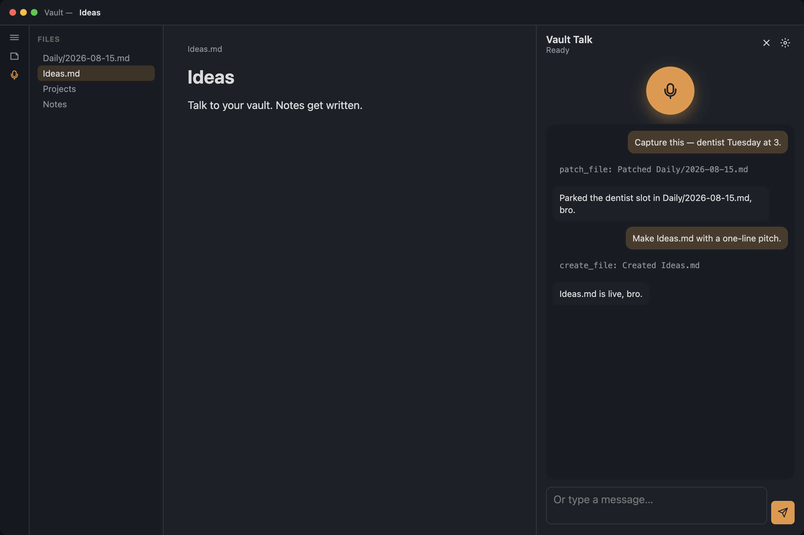

# Vault Talk

Talk to your [Obsidian](https://obsidian.md) vault. Speak or type; the agent can list, read, create, edit, or trash markdown notes — only the actions you allow.

Chat can be [Mistral](https://mistral.ai), [Ollama](https://ollama.com), or [LM Studio](https://lmstudio.ai). Speech can be Mistral Voxtral or this computer.



Desktop only (microphone).

## How to use

1. Install the plugin and enable it.
2. Open **Settings → Vault Talk**.
   - **Mistral chat or voice:** paste an API key from [console.mistral.ai](https://console.mistral.ai), or put `MISTRAL_API_KEY` in a vault `.env`.
   - **Ollama:** start Ollama, pick **Chat → Ollama**, then a model (`llama3.2`, …). Default `http://127.0.0.1:11434/v1`.
   - **LM Studio:** load a model, start the Developer server, pick **Chat → LM Studio**. Default `http://127.0.0.1:1234/v1`.
3. Click the ribbon mic, or run **Open**.
4. Tap the round **mic** button, talk, then pause. Type in the box if you prefer.

**Dictation** (settings toggle): speech to text only, no chat. Click a heading or place the cursor — the section highlights. **Fn** on Mac, **Ctrl+Shift+D** on Windows (remappable). Pause when you’re done; the transcript lands in that section.

Voice, accent, tools, and permissions live in **Settings → Vault Talk**.

Settings also include: personality note (default `Personality.md`), system prompt, context notes, notes folder, active file only, and open after write.

Delete is **off** by default. Internet is **off** by default.

## Privacy

Mistral slots send audio or note text to `api.mistral.ai`. Ollama / LM Studio chat and “This computer” speech stay on your machine. Do not enable write/delete on vaults you would not trust with the chat provider you picked.

## Commands

- Open
- Start talking
- Stop talking
- Dictate into note

## Development

```bash
npm install
npm run dev
```

Reload the plugin in Obsidian after a rebuild.

Release: bump `package.json` version, run `npm run version`, commit, tag `x.y.z` (no `v` prefix), and push the tag. GitHub Actions attaches `main.js`, `manifest.json`, and `styles.css`.

## License

MIT
